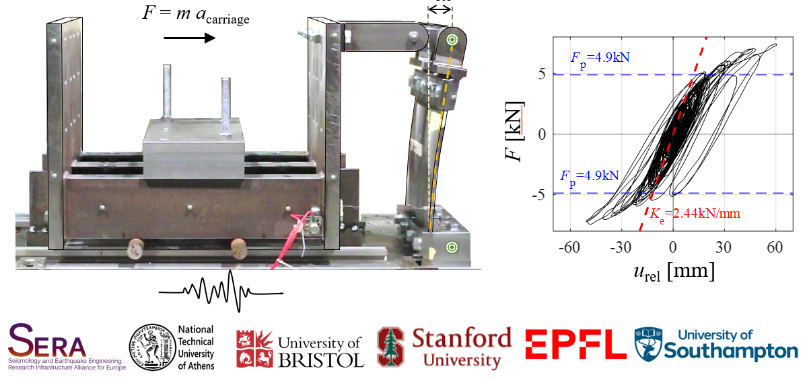

  

--------------

## SERA-NFUSE
Shake table test data of the SERA-NSFUSE Project - Ductile steel fuses for the protection of critical non-structural components

## Citation
Elkady, A. et al (2022). "Experimental Study to Validate an Improved Approach to Design Acceleration-Sensitive Nonstructural Components." Proceedings of the 5th International Workshop on the Seismic Performance of Non-Structural Elements (SPONSE), Stanford, California, USA.
